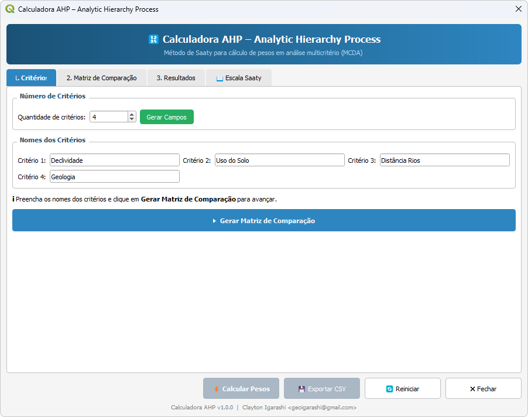
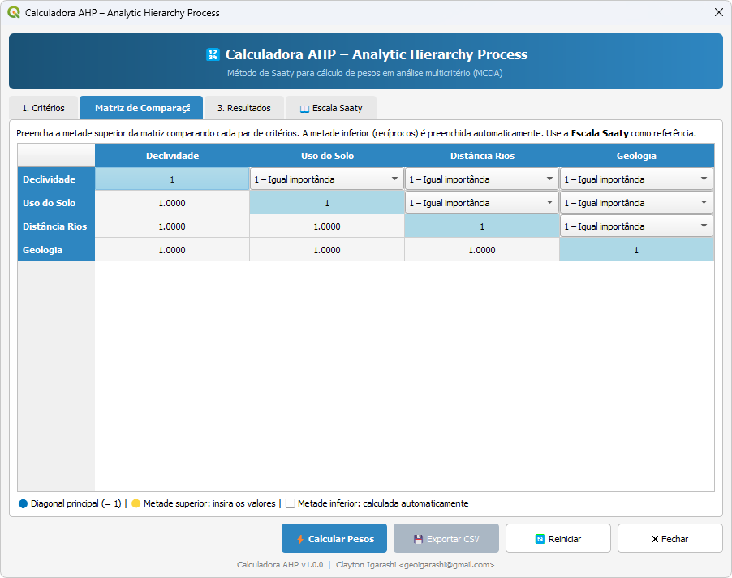
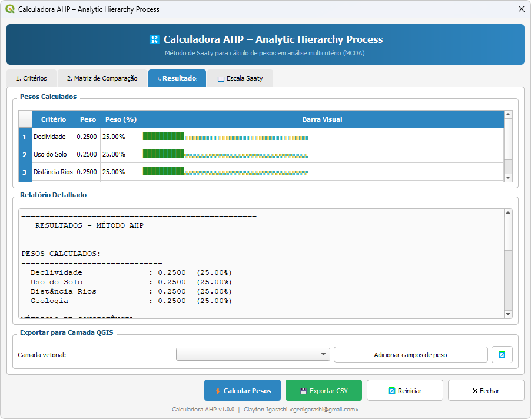
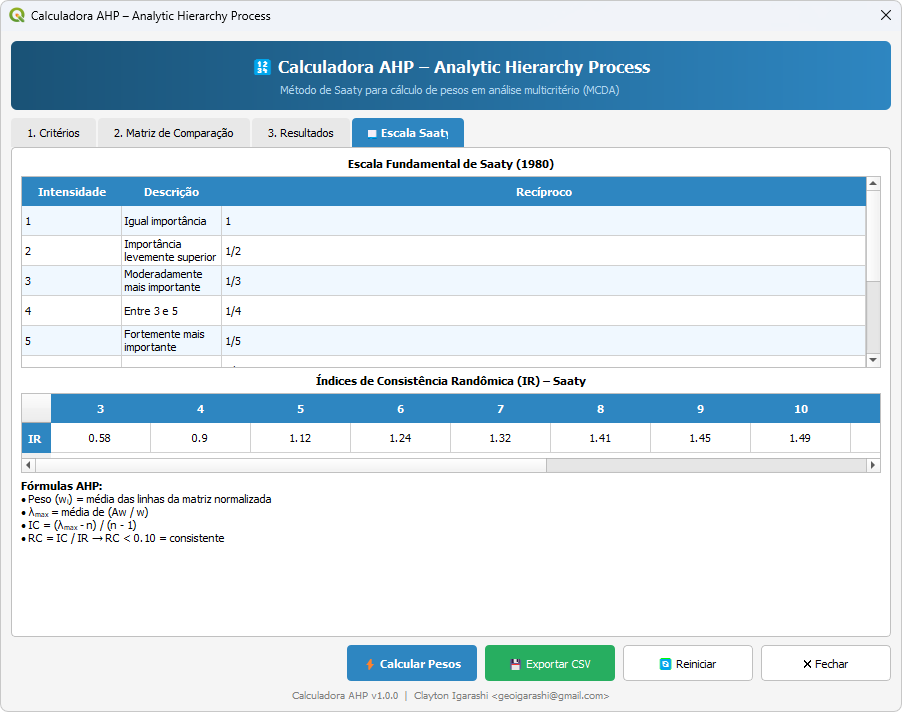

# Plugin AHP para QGIS
> **Calculadora de Pesos – Analytic Hierarchy Process (AHP)**

---

## O que é o AHP?

O **Processo Analítico Hierárquico (AHP)**, desenvolvido por Thomas L. Saaty (1980),
é um método de apoio à decisão multicritério que permite estruturar problemas complexos,
comparar alternativas e calcular pesos para critérios de forma sistemática e consistente.

---

## Telas do Plugin

### 1. Critérios
Define a quantidade e os nomes dos critérios que serão avaliados.  


### 2. Matriz de Comparação
Comparação par a par entre os critérios utilizando a escala fundamental de Saaty.  


### 3. Resultados
Visualização dos pesos calculados, verificação da Razão de Consistência (RC) e exportação de dados.  


### 4. Escala Saaty
Material de referência rápida contendo a escala de intensidade de importância e fórmulas aplicadas.  


---

## Instalação

### Método 1 – Via QGIS (recomendado)
1. Abra o QGIS
2. Menu **Complementos → Gerenciar e Instalar Complementos**
3. Clique em **Instalar a partir de um ZIP**
4. Selecione o arquivo `ahp_qgis_plugin.zip`
5. Clique em **Instalar**

### Método 2 – Manual
1. Extraia o conteúdo do ZIP
2. Copie a pasta `ahp_qgis_plugin` para o diretório de plugins do QGIS:
   - **Windows:** `C:\Users\<user>\AppData\Roaming\QGIS\QGIS3\profiles\default\python\plugins\`
   - **Linux:** `~/.local/share/QGIS/QGIS3/profiles/default/python/plugins/`
   - **macOS:** `~/Library/Application Support/QGIS/QGIS3/profiles/default/python/plugins/`
3. Reinicie o QGIS e ative o plugin em **Complementos → Gerenciar e Instalar Complementos**

### Dependência
O plugin requer **NumPy** (geralmente já incluído no QGIS):
```bash
# Se necessário, instale via OSGeo4W Shell (Windows):
pip install numpy
```

---

## Como Usar

### Passo 1 – Definir Critérios
- Informe a **quantidade de critérios** (2 a 15)
- Preencha os **nomes** de cada critério
- Clique em **Gerar Matriz de Comparação**

### Passo 2 – Preencher a Matriz
- Para cada par de critérios, selecione o valor na **Escala Saaty** (1 a 9)
- Os valores recíprocos são preenchidos automaticamente
- Use a aba **Escala Saaty** como referência

| Valor | Significado |
|-------|-------------|
| 1     | Igual importância |
| 3     | Moderadamente mais importante |
| 5     | Fortemente mais importante |
| 7     | Muito fortemente mais importante |
| 9     | Extremamente mais importante |
| 2,4,6,8 | Valores intermediários |

### Passo 3 – Calcular e Verificar
- Clique em **⚡ Calcular Pesos**
- Verifique a **Razão de Consistência (RC)**:
  - RC < 0.10 → Matriz **consistente** ✔
  - RC ≥ 0.10 → Revisão necessária ✘

### Passo 4 – Exportar
- **💾 Exportar CSV**: salva pesos e matriz em arquivo `.csv`
- **Exportar para Camada QGIS**: adiciona campos de peso em uma camada vetorial

---

## Fórmulas Matemáticas

```
Peso (wᵢ) = média das linhas da matriz normalizada
           = (1/n) × Σⱼ [aᵢⱼ / Σₖ aₖⱼ]

λ_max = média de [(A × w)ᵢ / wᵢ]

IC (Índice de Consistência) = (λ_max - n) / (n - 1)

RC (Razão de Consistência) = IC / IR

Critério: RC < 0.10 → Consistente
```

**Índices de Consistência Randômica (IR) de Saaty:**

| n | 3    | 4    | 5    | 6    | 7    | 8    | 9    | 10   |
|---|------|------|------|------|------|------|------|------|
|IR | 0.58 | 0.90 | 1.12 | 1.24 | 1.32 | 1.41 | 1.45 | 1.49 |

---

## Estrutura de Arquivos

```
ahp_qgis_plugin/
├── __init__.py        # Ponto de entrada do plugin QGIS
├── ahp_plugin.py      # Classe principal do plugin
├── ahp_dialog.py      # Interface gráfica completa (PyQt5)
├── ahp_core.py        # Núcleo matemático do AHP
├── test_ahp.py        # Testes independentes da lógica AHP
├── metadata.txt       # Metadados do plugin QGIS
├── icon.png           # Ícone do plugin
├── docs/              # Capturas de tela e documentação
└── README.md          # Este arquivo
```

---

## Referência

> Saaty, T.L. (1980). *The Analytic Hierarchy Process*.
> McGraw-Hill, New York.

---

## Versão e Compatibilidade

- **Versão do Plugin:** 1.0.0
- **QGIS mínimo:** 3.0
- **Python:** 3.6+
- **Dependências:** NumPy, PyQt5 (incluídos no QGIS)
